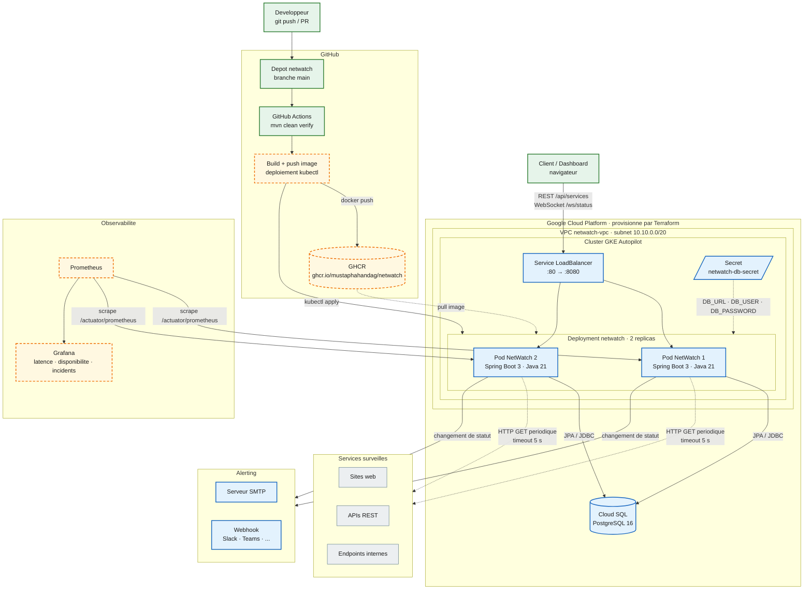
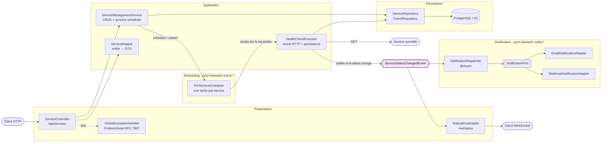
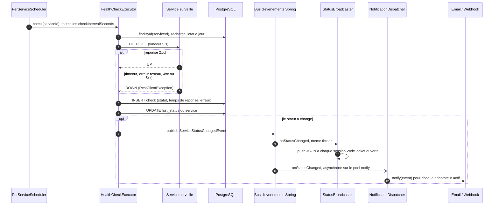
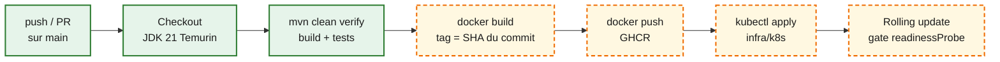

# NetWatch

Plateforme de supervision reseau : une API Spring Boot qui surveille la disponibilite de services (sites, APIs, endpoints internes), pousse les changements de statut en temps reel via WebSocket, et sera deployee de bout en bout sur Kubernetes avec une infra provisionnee en Terraform et un pipeline CI/CD complet.

Ce projet reprend l'esprit de ce que j'ai developpe en stage chez Orange Wholesale (APIs RESTful, WebSocket temps reel, notifications), mais concu et deploye de A a Z, avec une vraie chaine cloud-native autour.


## Fonctionnalites

- CRUD des services a surveiller (`/api/services`)
- Verification periodique automatique, **a l'intervalle propre de chaque service**, avec mesure du temps de reponse
- Historique des checks par service (`/api/services/{id}/checks`)
- Diffusion en temps reel des changements de statut via WebSocket (`/ws/status`)
- Alertes email et webhook sur changement de statut (activables independamment)
- Endpoint `/actuator/health` et `/actuator/prometheus` prets pour le monitoring
- Documentation API interactive via Swagger UI (`/swagger-ui.html`)

## Stack technique

- **Backend** : Spring Boot 3, Spring Data JPA, Spring WebSocket, Bean Validation
- **Base de donnees** : H2 en local, PostgreSQL en production (Cloud SQL)
- **Conteneurisation** : Docker (build multi-stage), docker-compose pour le dev local
- **Orchestration** : manifests Kubernetes (`infra/k8s`)
- **Infrastructure as Code** : Terraform pour provisionner un cluster GKE Autopilot et une instance Cloud SQL (`infra/terraform`)
- **CI/CD** : GitHub Actions (`.github/workflows/ci.yml`)
- **Observabilite** : metriques exposees via Spring Actuator + Micrometer, a brancher sur Prometheus/Grafana
- **Alerting** : email (Spring Mail) et webhook, chacun branche comme adaptateur derriere un evenement de changement de statut (voir ADR 0001)
- **Documentation API** : springdoc-openapi, spec OpenAPI 3 generee depuis le code + Swagger UI

## Architecture

NetWatch est un **monolithe modulaire event-driven**, conteneurise, deploye sur **GKE Autopilot** et adosse a **Cloud SQL**, le tout provisionne en **Terraform** et livre par **GitHub Actions**. Les quatre vues ci-dessous vont du plus large (le systeme dans son environnement) au plus fin (le cycle de vie d'un check).

**Legende des vues 1 et 4 :** vert = fonctionne aujourd'hui · bleu = code ecrit, pas encore deploye · orange pointille = a construire (voir [Roadmap](#roadmap)).

### 1. Vue d'ensemble — du `git push` a la production



| Brique | Role | Source |
|---|---|---|
| VPC + subnet dedie | Isole le cluster du reste du projet GCP | [`infra/terraform/main.tf`](infra/terraform/main.tf) |
| GKE Autopilot | Orchestration sans gestion de noeuds, facture au pod | [`infra/terraform/main.tf`](infra/terraform/main.tf) |
| Cloud SQL PostgreSQL 16 | Base managee (services surveilles + historique des checks) | [`infra/terraform/main.tf`](infra/terraform/main.tf) |
| Deployment (2 replicas) | Probes readiness/liveness sur `/actuator/health`, limites 500m CPU / 512Mi | [`infra/k8s/deployment.yaml`](infra/k8s/deployment.yaml) |
| Service LoadBalancer | IP publique, `:80` → `:8080` | [`infra/k8s/service.yaml`](infra/k8s/service.yaml) |
| Secret Kubernetes | Identifiants de base injectes en variables d'environnement | [`infra/k8s/secret.example.yaml`](infra/k8s/secret.example.yaml) |
| Image Docker | Build multi-stage, runtime JRE Alpine, utilisateur non-root | [`Dockerfile`](Dockerfile) |

### 2. Architecture applicative — a l'interieur d'un pod

Le code est decoupe en couches, et tout ce qui **reagit** a un changement de statut est branche derriere un evenement : le check ne sait pas qui l'ecoute. Ajouter un canal d'alerte (Slack, SMS, PagerDuty...) = une classe qui implemente `NotificationPort`, rien d'autre a modifier.



| Package | Responsabilite |
|---|---|
| `controller`, `dto`, `mapper` | Contrat HTTP. Les entites JPA ne sortent jamais de l'API : on expose des DTOs (`ServiceResponse`, `CheckResponse`) |
| `exception` | Erreurs HTTP explicites (404 en `ProblemDetail`) au lieu de 500 generiques |
| `service` | Logique metier : gestion des services surveilles, execution d'un check |
| `scheduling` | Une tache repetitive par service, a son propre intervalle, replanifiee a chaud a la creation / suppression |
| `event` | `ServiceStatusChangedEvent`, le point de decouplage entre detection et reaction |
| `realtime` | Diffusion WebSocket des changements de statut |
| `notification` | Port + adaptateurs email / webhook, executes hors du thread de check |
| `config` | Pools de threads, timeouts HTTP, proprietes d'alerting |
| `model`, `repository` | Entites JPA et acces aux donnees |

### 3. Cycle de vie d'un check



Trois garanties de conception decoulent de ce flux :

- **Un service lent n'en bloque aucun autre** : chaque service a sa propre tache, et chaque requete est bornee par un timeout (`netwatch.http-client.*`).
- **Une alerte lente ne retarde aucun check** : les notifications tournent sur un pool de threads separe de celui des checks.
- **Un adaptateur en panne n'empeche pas les autres** : chaque envoi est isole, l'echec est logue et le suivant part quand meme.

### 4. Pipeline de livraison



### Decisions d'architecture

| Decision | Pourquoi | Compromis accepte |
|---|---|---|
| Monolithe modulaire plutot que microservices | Un seul developpeur, un seul deploiement, une seule base : les microservices n'apporteraient que de la complexite operationnelle | Le bus d'evenements est in-process ; il faudra un broker (Kafka, RabbitMQ) si le monolithe est un jour scinde |
| Scheduling par service | Respecter `checkIntervalSeconds` et isoler les services lents les uns des autres | Une tache planifiee par service : a surveiller au-dela de quelques centaines de services |
| Evenement + ports & adaptateurs pour les reactions | Ajouter un canal d'alerte sans toucher au scheduler ni au check | Pas de retry/backoff sur les envois pour l'instant |
| GKE Autopilot | Pas de noeuds a dimensionner ni patcher, facturation au pod | Moins de controle sur la configuration des noeuds |
| Cloud SQL plutot que PostgreSQL dans le cluster | Sauvegardes, patchs et haute disponibilite geres par GCP | Cout et latence reseau legerement superieurs |
| Terraform pour toute l'infra | Environnement reproductible, versionne, detruisible en une commande | Etat Terraform a stocker et proteger (backend GCS a mettre en place) |

Le detail est dans [ADR 0001](docs/architecture/0001-modular-monolith-event-driven-notifications.md).

### Limites connues et prochaines etapes

Ces points sont identifies et assumes a ce stade du projet ; ils sont la suite logique de la roadmap.

- **Checks et alertes dupliques avec plusieurs replicas.** Le Deployment tourne en 2 replicas et chaque pod planifie *tous* les services : chaque check est fait deux fois, chaque alerte envoyee deux fois. Pistes : verrou distribue en base par execution (ShedLock sur PostgreSQL), election d'un leader (Spring Cloud Kubernetes), ou repartition des services par `hash(serviceId) % replicas`.
- **WebSocket et plusieurs pods.** Un client n'est connecte qu'a un seul pod. Une fois les checks dedupliques, un evenement detecte par le pod 2 ne sera plus vu par les clients du pod 1 : il faudra un relais inter-pods (PostgreSQL `LISTEN/NOTIFY` ou Redis pub/sub).
- **Connexion a Cloud SQL.** Le secret exemple pointe vers l'IP de l'instance ; la cible est le Cloud SQL Auth Proxy en sidecar avec Workload Identity (plus de mot de passe en clair ni d'IP autorisee).
- **Securite de l'API.** Pas d'authentification sur `/api/services`, et `/ws/status` accepte toutes les origines : a verrouiller avant toute exposition publique.
- **Schema de base.** `ddl-auto: update` en production ; la cible est des migrations versionnees (Flyway).
- **Tag d'image.** Le manifest reference `:latest` ; la CD devra deployer le tag SHA du commit pour des deploiements tracables et reversibles.

## Lancer le projet en local

```bash
mvn spring-boot:run
```

L'API demarre sur `http://localhost:8080` avec une base H2 en memoire (profil `local`, actif par defaut).

Creer un service a surveiller :

```bash
curl -X POST http://localhost:8080/api/services \
  -H "Content-Type: application/json" \
  -d '{"name": "Mon site", "url": "https://example.com", "checkIntervalSeconds": 60}'
```

## API

| Methode | Endpoint | Description |
|---|---|---|
| `GET` | `/api/services` | Liste tous les services surveilles |
| `POST` | `/api/services` | Cree un service (nom, url, `checkIntervalSeconds`) et le planifie immediatement |
| `GET` | `/api/services/{id}` | Detail d'un service |
| `PUT` | `/api/services/{id}` | Met a jour un service (nom, url, `checkIntervalSeconds`) et replanifie le check a chaud |
| `DELETE` | `/api/services/{id}` | Supprime un service et annule sa tache planifiee |
| `GET` | `/api/services/{id}/checks` | Historique des 50 derniers checks du service |
| `WS` | `/ws/status` | Diffusion temps reel des changements de statut |
| `GET` | `/actuator/health`, `/actuator/prometheus` | Sante et metriques |

Documentation interactive (Swagger UI) une fois l'application lancee : `http://localhost:8080/swagger-ui.html`
(spec brute : `http://localhost:8080/v3/api-docs`).

## Lancer avec Docker

```bash
docker compose up --build
```

Ceci demarre l'API (profil `prod`) et une base PostgreSQL locale.

## Roadmap

- [x] Phase 1 : API CRUD + scheduler de checks + WebSocket + stockage
- [x] Phase 2 : alertes email/webhook quand un service change de statut, gestion de l'intervalle par service
  (voir [ADR 0001](docs/architecture/0001-modular-monolith-event-driven-notifications.md) ;
  canaux desactives par defaut, a activer via `netwatch.notifications.*`)
- [x] Phase 3 : conteneurisation validee en local (kind/minikube) avant le cloud
- [ ] Phase 4 : provisioning Terraform du cluster GKE et de Cloud SQL
- [ ] Phase 5 : pipeline CI/CD complet (build image, push registry, deploiement automatique)
- [ ] Phase 6 : dashboards Prometheus/Grafana (latence, taux de disponibilite, incidents)

## Structure du depot

```
netwatch/
|-- src/main/java/com/mustapha/netwatch/
|   |-- controller/ dto/ mapper/ exception/   # couche presentation
|   |-- service/                              # logique metier
|   |-- scheduling/                           # une tache par service
|   |-- event/                                # ServiceStatusChangedEvent
|   |-- realtime/                             # WebSocket
|   |-- notification/                         # port + adaptateurs email / webhook
|   |-- config/                               # pools, timeouts, proprietes
|   `-- model/ repository/                    # persistance JPA
|-- docs/architecture/    # Architecture Decision Records
|-- infra/
|   |-- terraform/        # provisioning GCP (GKE + Cloud SQL)
|   `-- k8s/              # manifests de deploiement Kubernetes
|-- .github/workflows/    # pipeline CI/CD
|-- Dockerfile
`-- docker-compose.yml
```
