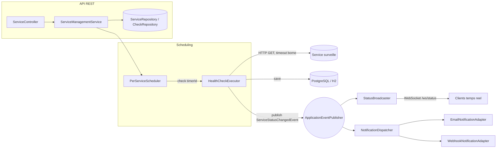

# ADR 0001 — Monolithe modulaire, event-driven, avec ports & adaptateurs pour les notifications

## Author, Time

Mustapha HANDAG
27/09/2026

## Contexte

NetWatch est un projet solo (roadmap phase 2 : alertes email/webhook + intervalle
de check par service). L'implementation initiale (phase 1) avait trois limites
structurelles qui bloquaient directement la phase 2 :

1. **Un seul scheduler global** (`@Scheduled(fixedDelay)`) qui ignorait le
   `checkIntervalSeconds` propre a chaque service et executait tous les checks
   sequentiellement sur un seul thread.
2. **Pas de timeout HTTP** sur le client de check : un service injoignable
   pouvait bloquer indefiniment le thread de check, gelant la supervision de
   tous les autres services.
3. **Couplage direct** entre l'execution du check et sa consequence (le
   controleur appelait les repositories directement, le scheduler appelait
   `StatusBroadcaster` en dur) : ajouter l'alerting email/webhook aurait
   voulu dire modifier le scheduler a chaque nouveau canal.

## Decision

**Pattern retenu : monolithe modulaire** (pas de microservices — equipe d'une
personne, un seul deploiement, une seule base de donnees ; cf. workflow de
selection du skill senior-architect : <10 devs + deploiement unique = monolithe
modulaire). A l'interieur, deux principes structurants :

### 1. Scheduling par service, pas de tick global

`PerServiceScheduler` planifie une tache repetitive independante par service
actif sur un `TaskScheduler` a pool dedie (`netwatch.scheduler.pool-size`).
Chaque service tourne a son propre `checkIntervalSeconds`. Un service lent ou
injoignable (desormais borne par un timeout HTTP explicite, voir
`RestClientConfig`) n'affecte plus les autres.

### 2. Ports & adaptateurs pour tout ce qui reagit a un changement de statut

`HealthCheckExecutor` ne connait que le domaine (executer un check, persister
un `Check`, publier un evenement). Il publie un `ServiceStatusChangedEvent`
via `ApplicationEventPublisher` quand le statut change — il ne sait pas qui
ecoute.

Deux consommateurs actuels de cet evenement, decouples l'un de l'autre :

- `StatusBroadcaster` (package `realtime`) : pousse l'evenement aux clients
  WebSocket connectes.
- `NotificationDispatcher` (package `notification`) : fan-out asynchrone
  (thread pool dedie, separe du pool de scheduling) vers chaque
  `NotificationPort` actif — `EmailNotificationAdapter` et
  `WebhookNotificationAdapter`, chacun active/desactive independamment via
  `netwatch.notifications.{email,webhook}.enabled`.

Ajouter un canal (Slack, SMS...) = implementer `NotificationPort`, rien
d'autre a modifier.

### 3. Separation contrat API / modele de persistance

`ServiceController` ne renvoie plus les entites JPA directement : des DTOs
(`ServiceResponse`, `CheckResponse`) via `ServiceMapper` decouplent le contrat
HTTP du schema de base. La logique CRUD est sortie du controleur vers
`ServiceManagementService`, qui est aussi le point qui garde le scheduler
synchronise (schedule a la creation, cancel a la suppression).

### 4. Erreurs HTTP explicites

`ResourceNotFoundException` + `GlobalExceptionHandler` (`@RestControllerAdvice`)
remplacent le comportement precedent ou un `DELETE` sur un id absent
remontait une `EmptyResultDataAccessException` non geree (500 generique) au
lieu d'un 404.

## Consequences

**Positif :**
- Le prochain item de roadmap ("gestion de l'intervalle par service") est
  resolu par construction, pas par un correctif ponctuel.
- Ajouter un canal d'alerte ou reagir autrement a un changement de statut ne
  touche plus au scheduler ni a l'executor.
- Un service qui repond lentement n'affecte plus la supervision des autres.

**Compromis acceptes :**
- Les evenements Spring (`ApplicationEventPublisher`) sont in-process : si le
  monolithe est un jour scinde en services, ce bus devra migrer vers quelque
  chose comme Kafka/RabbitMQ. Acceptable tant que le deploiement reste
  unique (cf. decision monolithe modulaire ci-dessus).
- `NotificationDispatcher` avale les exceptions par adaptateur (log + continue)
  plutot que de retenter : suffisant pour un outil de supervision perso, pas
  pour une garantie de livraison d'alerte critique.
- Pas de mecanisme de retry/backoff sur l'envoi email/webhook — a ajouter si
  la fiabilite des alertes devient un besoin reel (ex. file d'attente locale
  avant d'exposer publiquement l'outil).

## Suivi (hors scope de ce changement)

- `WebSocketConfig` autorise `setAllowedOrigins("*")` — a restreindre avant
  toute exposition publique (phase 4+, cluster GKE).
- Pas de validation contre le SSRF sur l'URL d'un service surveille (interne
  vs externe) — acceptable pour un outil mono-utilisateur, a revisiter si
  l'API devient multi-tenant.
